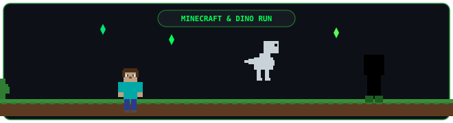

<div align="center">

  <!-- 1. Hacker Terminal Animation Showcase (NICK 3D Figlet Block Terminal) -->
  

  <br/><br/>

  <!-- 2. Minecraft Crypto Mining & Blockchain Ticker SVG Animation -->
  

  <br/><br/>

  <!-- 3. Animated Minecraft Steve & Chrome Dinosaur Runner SVG -->
  

  <br/><br/>

  <!-- 4. Green Dynamic Typing SVG -->
  <a href="https://github.com/NickXBT">
    
  </a>

  <br/><br/>

  <!-- 5. Developer Badges -->
  
  
  
  

  <br/><br/>

  <!-- 6. Interactive Buttons -->
  <a href="https://NickXBT.github.io/resturant">
    
  </a>
  <a href="https://linkedin.com/in/nikhilawadhwal">
    
  </a>
  <a href="mailto:nikhil24x5183@gmail.com">
    
  </a>

  <br/><br/>

  <!-- 7. Profile Views & Follower Telemetry -->
  
  
  

</div>

<br/>

<!-- Minecraft Emerald Waving Section Divider -->


---

## 🛠️ Languages & Tech Stack

<div align="center">

<p>
  
  
  
  
  
</p>

<br/>

<p>
  <a href="https://skillicons.dev">
    
  </a>
</p>

</div>

<br/>

<!-- Minecraft Steve & Chrome Dino Divider -->
<div align="center">
  
</div>

---

## 🐍 Minecraft Contribution Snake & Real-Time Stats

<div align="center">

  <!-- Animated Contribution Grid Snake connected to NickXBT -->
  

  <br/><br/>

  <!-- Dynamic GitHub Profile Stats Cards connected to NickXBT -->
  <p align="center">
    
    &nbsp;
    
  </p>

</div>

---

## ⚡ Featured Projects & Repositories

<details>
<summary><b>🕵️ TRACE FINDERS — AI Criminal Network Analysis (SIH Finalist)</b></summary>
<br/>
AI-powered criminal network analysis & evidence fusion system engineered to process heterogeneous forensic data.
<br/>
📂 <b>Repository</b>: <a href="https://github.com/NickXBT/tracefinders">NickXBT/tracefinders</a>
</details>

<br/>

<details>
<summary><b>🛡️ ScanShield — AI Scam & Fraud Detection Platform</b></summary>
<br/>
Scans SMS, WhatsApp, emails, screenshots, URLs, and documents to flag phishing and scam risks.
<br/>
🔗 <b>Live Demo</b>: <a href="https://scamshield-ten-theta.vercel.app">scamshield-ten-theta.vercel.app</a>
</details>

<br/>

<details>
<summary><b>⚡ VibeShield — AI Code Security Auditor (x402 Global Challenge)</b></summary>
<br/>
AI agent built at x402 Global Challenge PreHack (Bengaluru) using Algorand HTTP 402 pay-per-use micropayments (~0.5 ALGO/scan) to issue on-chain NFT audit certificates.
<br/>
🔗 <b>Live Demo</b>: <a href="https://hackthonn-two.vercel.app">hackthonn-two.vercel.app</a> | 📂 <b>Repo</b>: <a href="https://github.com/NickXBT/x402">NickXBT/x402</a>
</details>

<br/>

<details>
<summary><b>🏢 ECE Department ERP — Smart Academic Management System</b></summary>
<br/>
Digitizes timetables, certificate approvals, and credit workflows with role-based student/faculty dashboards.
<br/>
🔗 <b>Live Demo</b>: <a href="https://ece-campus-erp-8qn9.vercel.app">ece-campus-erp-8qn9.vercel.app</a> | 📂 <b>Repo</b>: <a href="https://github.com/NickXBT/ece-campus-erp">NickXBT/ece-campus-erp</a>
</details>

<br/>

<details>
<summary><b>🛒 SmartMart — Queueless Self-Billing App</b></summary>
<br/>
Self-checkout retail app with customer portal & admin inventory pricing dashboard.
<br/>
📂 <b>Repository</b>: <a href="https://github.com/NickXBT/smartmart-self-billing-app">NickXBT/smartmart-self-billing-app</a>
</details>

---

## 🎯 Current Focus & Connect

```yaml
learning: "Minecraft Plugins, AI Agents, Data Structures & Algorithms, Drone Firmware"
building: "ScanShield & VibeShield AI Security Systems"
exploring: "ISRO Space Tech AI & Jetson Nano Autonomous Robotics"
open_to: "AI / Robotics / Software Engineering Internships"
```

<div align="center">

  <a href="mailto:nikhil24x5183@gmail.com">
    
  </a>
  &nbsp;
  <a href="https://linkedin.com/in/nikhilawadhwal">
    
  </a>
  &nbsp;
  <a href="https://github.com/NickXBT">
    
  </a>

</div>
